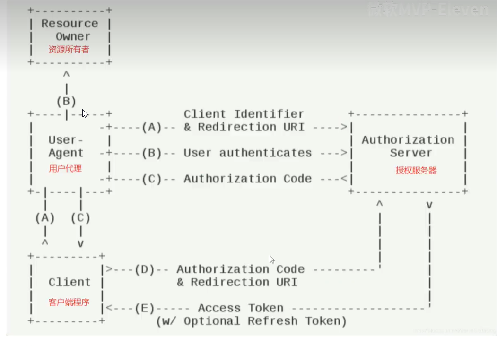

# 工作流程



# 端口配置：

客户端： MVC 应用程序： https://localhost:7001
授权服务器：https://localhost:5001

# copy 密码模式的代码到新文件夹

授权码模式是基于密码模式的升级，把密码模式的代码复制到一个新的文件夹，继续升级得到授权码模式

# 打开新文件夹中的授权服务器项目

命令添加界面
cd C:\Code\0.identityserver4-richard\003-授权码模式\IdentityServer\Authorization.IdentityServer

```
dotnet new is4ui
```

会多出来 quickstart, Views, wwwroot 文件夹

# 创建 MvcClient 工程

cd C:\Code\0.identityserver4-richard\003-授权码模式\Client
dotnet new mvc -n MvcClient

## 添加到解决方案中去

dotnet sln add MvcClient\MvcClient.csproj
