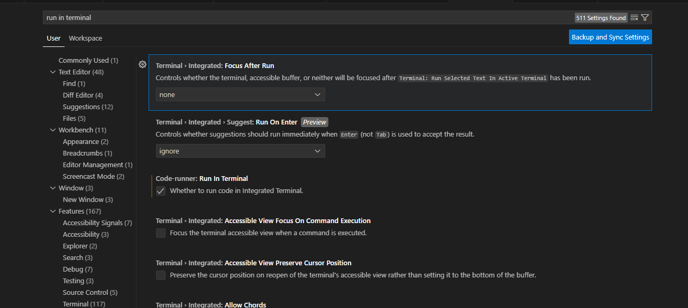
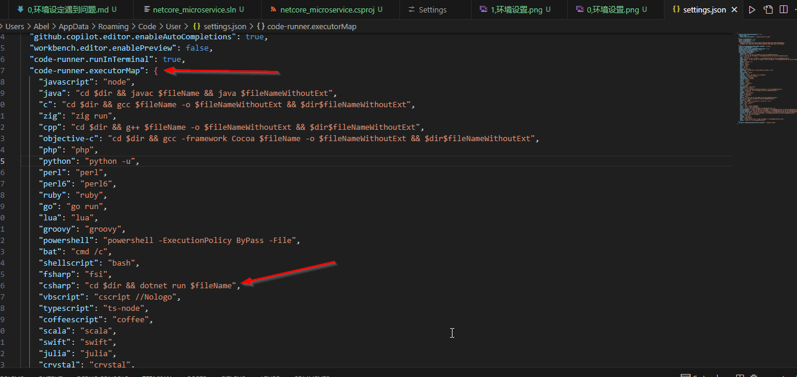
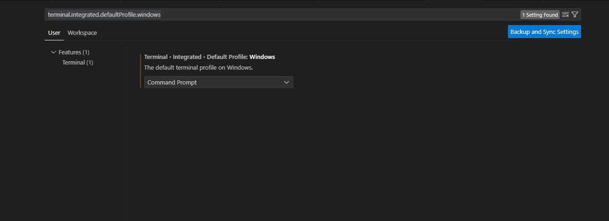
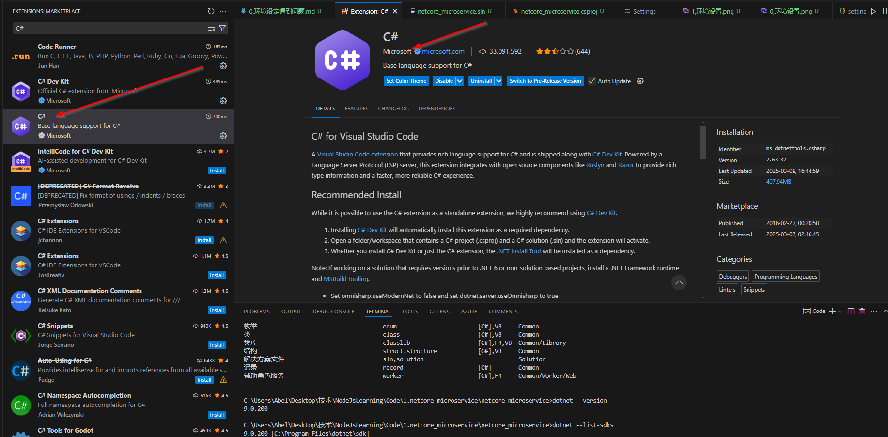

# netCore_MicroService

## vs code 设定视频

https://www.bilibili.com/video/BV19Y4y1G78u/?spm_id_from=333.337.search-card.all.click&vd_source=b9464c0ecfa02375d34808b56bd7e53f

dotnet --version
dotnet new console

code runner 安装插件

settings--> run in terminal

加上 code-runner.executorMap

## settings 中搜索'terminal.integrated.defaultProfile.windows'

我现在 vs code 中去 run code，提示我，The terminal process failed to launch: accsss was denied to the path containing your executable "c:\windows\....\powershell.exe", manage and cange your permissions to get this to work,

需要安装 C#插件

需要安装 code runner 插件

dotnet run

添加包
dotnet add package HK.NET

还原项目中的 包
dotnet restore

## 要在现有的解决方案 netcore_microservice.sln 中添加一个类库项目，并使现有的控制台应用程序 netcore_microservice.csproj 引用该类库，

### 创建类库项目：在终端中执行以下命令，创建一个新的类库项目（例如，命名为 MyLibrary）：

dotnet new classlib -n MyLibrary
这将生成一个名为 MyLibrary 的文件夹，其中包含类库项目的文件。

### 将类库项目添加到解决方案

dotnet sln netcore_microservice.sln add MyLibrary/MyLibrary.csproj

### 在控制台应用程序中添加对类库的引用

dotnet add netcore_microservice.csproj reference MyLibrary/MyLibrary.csproj
